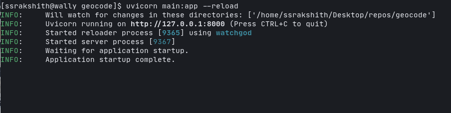
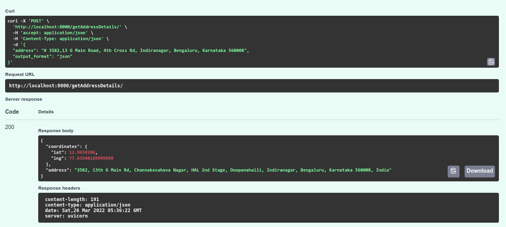
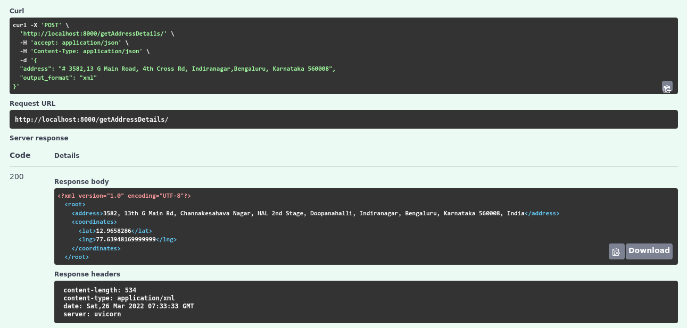

# Geocode

## About

A FastAPI api, that returns coordinates of a given address using google maps API.

## Running the application

To run the application:

+ first install FastAPI using pip

    ```sh
    pip install "fastapi[all]"
    ```
+ This API requires a [Google Maps API](https://developers.google.com/maps/documentation/geocoding/overview) Key to return a coordinate response for every request.

  ```bash
    export GMAPS_API=<PASTE_YOUR_API_KEY_HERE>
  ```
  The GMAPS_API Key is then used in the main.py

  ```python
    API_KEY = os.environ.get('GMAPS_API')
  ```


+ Then run the uvicorn server

    ```
    uvicorn main:app --reload
    ```

    

## Outputs

  JSON Response

  

  XML Response

  

